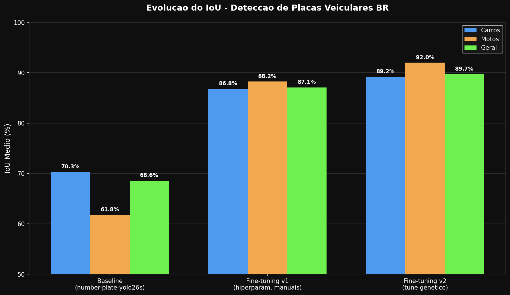

# License Plate Detection BR — YOLO26s Fine-tuning

Evolução de um modelo de detecção de placas veiculares para o contexto brasileiro,
partindo do modelo base YOLO26s, passando por fine-tuning supervisionado e chegando
à otimização genética de hiperparâmetros.

---

## Evolução do Modelo



| Etapa | Modelo | mAP@50 | mAP@50-95 | IoU Geral |
|---|---|---|---|---|
| Baseline | number-plate-yolo26s | 83,11% | 45,00% | 68,60% |
| Fine-tuning v1 | best_placas_v1 | 96,83% | 76,33% | 87,10% |
| Fine-tuning v2 (tune genético) | best_placas_v2 | 97,04% | 81,70% | 89,74% |

---

## Resultados por Tipo de Veículo (best_placas_v2)

| Tipo | Imagens | IoU | mAP@50 | mAP@50-95 |
|---|---|---|---|---|
| Carros | 1440 | 89,18% | 95,85% | 80,57% |
| Motos | 360 | 91,99% | 100,00% | 86,25% |
| Geral | 1800 | 89,74% | 97,04% | 81,70% |

---

## Modelos

Os modelos estão disponíveis no HuggingFace:

👉 https://huggingface.co/RodrigoRRC/license-plate-br-yolo26s

| Arquivo | Descrição |
|---|---|
| `best_placas_v1.pt` | Fine-tuning com hiperparâmetros manuais |
| `best_placas_v2.pt` | Fine-tuning com hiperparâmetros otimizados geneticamente |

---

## Dataset

Treinado e avaliado no **UFPR-ALPR Dataset** (4.500 imagens, 150 veículos, 1.920×1.080px).

O dataset é restrito para uso acadêmico. Veja instruções de acesso em:
[`UFPR-ALPR dataset/README.md`](UFPR-ALPR%20dataset/README.md)

---

## Modelo Base

Baseado no **number-plate-yolo26s** de Muhammad Rizwan Munawar (licença AGPL-3.0):
https://platform.ultralytics.com/muhammadrizwanmunawar/datasets/number-plate

---

## Como Usar

### Com Docker

```bash
docker build -t license-plate-br .
docker run -v $(pwd)/UFPR-ALPR\ dataset:/app/dataset license-plate-br
```

### Direto com Python

**1. Instalar dependências**

```bash
pip install ultralytics huggingface_hub
```

**2. Baixar o modelo do HuggingFace**

```python
from huggingface_hub import hf_hub_download

hf_hub_download(
    repo_id="RodrigoRRC/license-plate-br-yolo26s",
    filename="best_placas_v2.pt",
    local_dir="."
)
```

**3. Rodar inferência**

```python
from ultralytics import YOLO

modelo = YOLO("best_placas_v2.pt")
resultados = modelo.predict(source="imagem.jpg", conf=0.5)
resultados[0].show()
```

**4. (Opcional) Rodar avaliação completa por tipo de veículo**

```bash
python src/avaliacao/eval_por_tipo_best_placas.py
```

---

## Estrutura do Repositório

```
├── src/
│   ├── avaliacao/
│   │   ├── eval_por_tipo_best_placas.py     # Avaliação do modelo v2
│   │   └── eval_por_tipo_number_plate_s.py  # Avaliação do modelo baseline
│   ├── treinamento/
│   │   ├── fine_tuning.py                   # Fine-tuning local/OCI
│   │   └── fine_tuning_colab.py             # Fine-tuning no Google Colab
│   ├── otimizacao/
│   │   ├── tune_colab.py                    # Busca genética no Colab
│   │   └── tune_kaggle.py                   # Busca genética no Kaggle
│   └── graficos/
│       └── gerar_grafico.py                 # Geração de gráficos de evolução
├── Docs/
│   ├── guia_colab.md
│   ├── guia_kaggle.md
│   ├── evolucao_genetica_hiperparametros.md
│   ├── glossario_parametros.md
│   ├── parametros_treino_original.md
│   ├── plano_fine_tuning.md
│   └── evolucao_iou.png                  # Gráfico de evolução do IoU
├── UFPR-ALPR dataset/
│   └── README.md                        # Instruções para obter o dataset
├── Dockerfile
├── requirements.txt
└── README.md
```

---

## Citação

Se usar este trabalho, cite o dataset original:

> R. Laroca et al., "A Robust Real-Time Automatic License Plate Recognition Based on the YOLO Detector", IJCNN 2018.

---

## Licença

AGPL-3.0 — herdada do modelo base de Muhammad Rizwan Munawar.

---

## Autor

Rodrigo Ribeiro Carvalho  
[GitHub](https://github.com/Rodrigo-RRC) · [HuggingFace](https://huggingface.co/RodrigoRRC)
